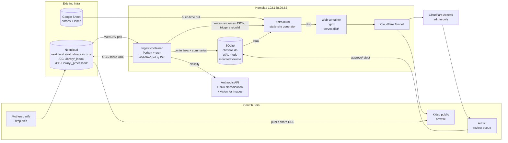

# Chronos — Architecture & Build Plan

> Status: **Draft for approval.** No implementation code has been written. After you sign off (or push back), I will scaffold the repo skeleton in a separate commit.

---

## 1. Executive summary

Chronos is a statically-generated, self-hosted interactive timeline of biblical history with toggleable parallel civilisation lanes, where every entry (person, event, period, prophecy) is a hub for curated learning resources. Content lives in three places: timeline entries in a Google Sheet (build-time pull), wiki articles as Markdown in this repo, and learning files in an existing Nextcloud instance. A Python cron job polls Nextcloud, classifies new files via Claude Haiku, writes links into SQLite, and triggers an Astro rebuild; the public site is served by nginx behind a Cloudflare Tunnel. Phase 1 (MVP) is the static site + ~30 manually authored entries + vis-timeline canvas, with the ingest pipeline deferred to Phase 2.

---

## 2. Pushback on the brief (read this before signing off)

Five points where the brief is either internally inconsistent or under-specified. I'd like a decision on each before I scaffold.

1. **vis-timeline + signed-year chronology is partially in tension.** The brief mandates signed integer years and warns that `Date` can't represent pre-AD 1 years. That warning is *half* right: JavaScript `Date` *can* represent ~271,000 BC via `new Date(year, ...)`, but `Date.parse`, ISO 8601 strings, and most formatting helpers break on negative years. vis-timeline accepts `Date` objects, so we *can* use it for BC dates if we construct dates explicitly with the numeric constructor and supply a custom formatter for the time-axis labels. **Recommendation:** keep vis-timeline for Phase 1 but isolate every `Date` construction behind a `toTimelineDate(year)` helper and a custom axis formatter; budget a Phase 3 swap to a D3 + SVG custom canvas if we hit a wall (e.g. label collision, mobile pinch behaviour, or BC-axis tick rendering).
2. **Full Astro rebuild on every ingest is wasteful.** Open Q6 asks how rebuild should work. At ~30 entries the rebuild is seconds; at hundreds with media, minutes. **Recommendation:** keep Astro fully static for entry pages (SEO is the whole reason we chose Astro), but make the *resources panel* an island that fetches a small per-entry JSON manifest (`/api/entry/{slug}/resources.json`) served as a static file written by the ingest job. New file → ingest rewrites just that JSON + a manifest index → no Astro rebuild needed for the common case. Trigger a full rebuild only on (a) new entries added, (b) wiki edits, (c) nightly. This is documented in §8.
3. **Single Haiku call with the full entry list in the prompt scales linearly.** At 30 entries fine; at the eventual ~850 (the reference site's count) the prompt is ~50–80KB per file × N files/day. **Recommendation:** for Phase 2, send the full list with prompt caching (`cache_control` on the entry-list block) so the per-call cost collapses to the prompt-cache read rate. Only reach for a coarse pre-filter (keyword on lane labels + era buckets) if cached cost still hurts. This is cheaper *and* simpler than vector embeddings, which the brief rightly rejects.
4. **SQLite shared between two containers needs WAL + a single writer.** SQLite can absolutely back this, but a mounted-volume sharing pattern with the ingest container writing while the Astro build/runtime reads requires WAL mode and discipline (only the ingest container writes). **Recommendation:** WAL on, ingest container is sole writer, web container opens read-only. The Astro build step reads the DB to generate static pages and never holds a handle at runtime.
5. **Chronology tradition isn't a minor decision.** Picking Ussher locks dates like Creation = 4004 BC and a Long Sojourn that many conservative Reformed scholars dispute. **Recommendation:** primary dates use a documented tradition (I'd pick Ussher for CC alignment), but the schema carries `start_year_alt_json` so an entry can declare `{"masoretic": -1446, "lxx": -1491}` and we surface "Dating tradition: …" on entry pages. Adds one column and 90% of the future flexibility.

---

## 3. Architecture diagram



---

## 4. Repo structure

```
chronos/
├── PLAN.md                          this document
├── README.md                        run + deploy instructions
├── .env.example                     all env vars, no secrets
├── docker-compose.yml               web + ingest containers
├── .github/workflows/               CI: typecheck, schema validate, build
│
├── apps/
│   ├── site/                        Astro 4 project
│   │   ├── astro.config.mjs
│   │   ├── tailwind.config.cjs
│   │   ├── src/
│   │   │   ├── pages/               routes (static)
│   │   │   ├── layouts/
│   │   │   ├── components/
│   │   │   │   ├── timeline/        vis-timeline island
│   │   │   │   ├── resources/       resources panel island
│   │   │   │   └── ui/              static components
│   │   │   ├── content/
│   │   │   │   └── wiki/            Markdown articles, one per entry slug
│   │   │   ├── lib/                 shared utilities (date helpers, db reader)
│   │   │   └── styles/
│   │   ├── public/
│   │   └── scripts/
│   │       ├── pull-sheet.ts        Google Sheet → src/data/entries.json
│   │       └── validate-schema.ts   Zod validation, fails build on bad data
│   │
│   └── ingest/                      Python ingest service
│       ├── pyproject.toml
│       ├── chronos_ingest/
│       │   ├── __init__.py
│       │   ├── main.py              entry point, cron-runnable
│       │   ├── config.py            pydantic-settings
│       │   ├── nextcloud.py         WebDAV poll, OCS share creation
│       │   ├── extract.py           pdfplumber, Pillow, ffprobe wrappers
│       │   ├── classify.py          Anthropic Haiku client w/ prompt cache
│       │   ├── db.py                SQLite writer (WAL, sole writer)
│       │   ├── rebuild.py           touch trigger or webhook
│       │   └── admin_api.py         FastAPI for /admin/review actions
│       ├── tests/
│       └── Dockerfile
│
├── db/
│   ├── migrations/                  numbered SQL files
│   │   ├── 0001_init.sql
│   │   └── 0002_search_fts.sql      Phase 3
│   └── seed/                        seed lanes + Phase 1 entries
│
├── docs/
│   ├── chronology.md                dating tradition decisions
│   ├── content-pipeline.md          how mothers add files
│   └── copyright.md                 CC, ESV, artwork attribution
│
└── scripts/
    ├── backup-db.sh                 nightly SQLite + Nextcloud manifest backup
    └── dev.sh                       local dev wrapper
```

---

## 5. Database schema (SQLite, WAL)

```sql
PRAGMA journal_mode = WAL;
PRAGMA foreign_keys = ON;

CREATE TABLE lanes (
  id              INTEGER PRIMARY KEY,
  slug            TEXT NOT NULL UNIQUE,
  label           TEXT NOT NULL,
  colour          TEXT NOT NULL,                   -- hex
  group_label     TEXT NOT NULL,                   -- "Biblical (base)", "Empires", ...
  default_visible INTEGER NOT NULL DEFAULT 1,      -- 0/1
  base_layer      INTEGER NOT NULL DEFAULT 0,      -- 1 = always on, not hideable
  sort_order      INTEGER NOT NULL DEFAULT 0
);

CREATE TABLE entries (
  id                  INTEGER PRIMARY KEY,
  slug                TEXT NOT NULL UNIQUE,
  title               TEXT NOT NULL,
  type                TEXT NOT NULL CHECK (type IN ('person','event','period','prophecy')),
  lane_id             INTEGER NOT NULL REFERENCES lanes(id),
  start_year          INTEGER NOT NULL,            -- signed; BC negative
  end_year            INTEGER,                     -- null for point events
  display_dates       TEXT NOT NULL,               -- "c. 1010 – 970 BC"
  importance          INTEGER NOT NULL DEFAULT 3 CHECK (importance BETWEEN 1 AND 5),
  parent_period_slug  TEXT REFERENCES entries(slug),
  scripture_refs_json TEXT,                        -- JSON array
  summary             TEXT NOT NULL,               -- ~200 chars; used for tooltips + LLM
  wiki_md             TEXT,                        -- full article; null if no wiki yet
  artwork_url         TEXT,
  start_year_alt_json TEXT,                        -- {"masoretic":-1446,"lxx":-1491}
  chronology_note     TEXT,
  lang                TEXT NOT NULL DEFAULT 'en',
  created_at          TEXT NOT NULL DEFAULT (datetime('now')),
  updated_at          TEXT NOT NULL DEFAULT (datetime('now'))
);
CREATE INDEX idx_entries_lane ON entries(lane_id);
CREATE INDEX idx_entries_year ON entries(start_year, end_year);
CREATE INDEX idx_entries_importance ON entries(importance);

CREATE TABLE files (
  id              INTEGER PRIMARY KEY,
  nextcloud_path  TEXT NOT NULL UNIQUE,
  public_url      TEXT,                            -- OCS share, null until generated
  file_type       TEXT NOT NULL CHECK (file_type IN ('pdf','video','audio','image','doc')),
  title           TEXT NOT NULL,
  size_bytes      INTEGER,
  duration_seconds INTEGER,
  extracted_text  TEXT,                            -- first ~3000 chars
  ai_summary      TEXT,
  cc_cycle        INTEGER,
  cc_week         INTEGER,
  age_min         INTEGER,
  age_max         INTEGER,
  processed_at    TEXT,
  status          TEXT NOT NULL DEFAULT 'pending'
                  CHECK (status IN ('pending','processed','needs_review','failed')),
  error_message   TEXT
);
CREATE INDEX idx_files_status ON files(status);
CREATE INDEX idx_files_type ON files(file_type);

CREATE TABLE links (
  id            INTEGER PRIMARY KEY,
  entry_id      INTEGER NOT NULL REFERENCES entries(id) ON DELETE CASCADE,
  file_id       INTEGER NOT NULL REFERENCES files(id) ON DELETE CASCADE,
  confidence    REAL NOT NULL CHECK (confidence BETWEEN 0 AND 1),
  source        TEXT NOT NULL CHECK (source IN ('auto','manual')),
  reason        TEXT,
  needs_review  INTEGER NOT NULL DEFAULT 0,
  created_at    TEXT NOT NULL DEFAULT (datetime('now')),
  confirmed_at  TEXT,
  confirmed_by  TEXT,
  UNIQUE (entry_id, file_id)
);
CREATE INDEX idx_links_entry ON links(entry_id, confidence DESC);
CREATE INDEX idx_links_review ON links(needs_review) WHERE needs_review = 1;

CREATE TABLE related_entries (
  entry_id          INTEGER NOT NULL REFERENCES entries(id) ON DELETE CASCADE,
  related_entry_id  INTEGER NOT NULL REFERENCES entries(id) ON DELETE CASCADE,
  relationship_type TEXT NOT NULL CHECK (relationship_type IN
                    ('parent','child','references','fulfils_prophecy','fulfilled_by')),
  PRIMARY KEY (entry_id, related_entry_id, relationship_type)
);

CREATE TABLE failed_imports (
  id              INTEGER PRIMARY KEY,
  nextcloud_path  TEXT NOT NULL,
  error_message   TEXT NOT NULL,
  attempted_at    TEXT NOT NULL DEFAULT (datetime('now')),
  retry_count     INTEGER NOT NULL DEFAULT 0
);

-- Phase 3
-- CREATE VIRTUAL TABLE entries_fts USING fts5(
--   slug, title, summary, wiki_md, content='entries', content_rowid='id'
-- );
```

Notes:
- `start_year` is a plain signed integer. No `Date`, no ISO strings. The frontend converts to `Date` only at the vis-timeline boundary.
- `lang` on entries supports the future Afrikaans build by adding rows rather than another schema. Phase 1 is `en` only.
- `start_year_alt_json` captures the chronology-tradition flexibility (see pushback §2.5).

---

## 6. Astro project structure

**Pages (all static):**
```
/                                index — featured eras, recent entries
/timeline                        canvas-driven view (vis-timeline island)
/entry/[slug]                    one page per entry, prerendered
/era/[slug]                      period landing pages (Patriarchs, Kingdoms, ...)
/lane/[slug]                     all entries in one lane
/about
/admin/review                    protected behind Cloudflare Access (only route w/ runtime API)
404
```

**Layouts:**
- `BaseLayout.astro` — head, OG tags, fonts, nav
- `EntryLayout.astro` — entry hero + wiki + resources panel + cross-links + prev/next

**Components (static):**
- `EntryHero`, `ScriptureRefs`, `LaneBadge`, `EraJump`, `Footer`, `Nav`

**Components (islands, `client:visible` or `client:idle`):**
- `TimelineCanvas` — vis-timeline; receives `lanes`, `entries`, initial URL state
- `LaneToggleSidebar` — reads/writes URL state
- `ResourcesPanel` — fetches `/data/entries/{slug}.json` for live resource list (so we don't full-rebuild on every file ingest)
- `FavouriteButton` — localStorage only
- `SearchBox` — Phase 3, FTS5 via tiny API

**Content collections:**
- `wiki` — `src/content/wiki/{slug}.md`. Front-matter validated by Zod schema; required fields: `slug`, `title`, `lastReviewed`. Build fails on mismatch with `entries` table.

**Data flow at build time:**
1. `scripts/pull-sheet.ts` pulls Google Sheet → `src/data/entries.json` + `src/data/lanes.json`.
2. `scripts/validate-schema.ts` cross-checks entries vs wiki Markdown vs SQLite. Fails on duplicates, unknown lanes, missing required fields.
3. Astro reads JSON + SQLite (read-only) and generates pages.
4. For each entry, also emits `dist/data/entries/{slug}.json` containing `{ resources: [...] }` — the ingest writes to this directly between full builds.

**Date helper boundary:**
```ts
// apps/site/src/lib/dates.ts
export const YEAR_OFFSET = 0;  // raw signed years; helper isolates Date construction
export function yearToTimelineDate(year: number, month = 0, day = 1): Date {
  const d = new Date(0);
  d.setUTCFullYear(year, month, day);
  return d;
}
export function formatYear(y: number): string {
  return y < 0 ? `${-y} BC` : `AD ${y}`;
}
```

---

## 7. Python ingest structure

**Entry point:** `python -m chronos_ingest` (cron) and `python -m chronos_ingest.admin_api` (FastAPI under uvicorn, for the review queue).

**Modules:**
- `config.py` — `pydantic-settings`, reads from env: Nextcloud URL/user/pass, Anthropic key, SQLite path, daily Haiku cost ceiling, rebuild trigger path.
- `nextcloud.py` — WebDAV client (`webdavclient3`), listing `_inbox/`, downloading to temp, moving to `_processed/`, OCS share-link creation via REST.
- `extract.py` — strategy dispatch by file type:
  - PDF: `pdfplumber` → first ~3000 chars; `pdf2image` first page → thumbnail.
  - Image: `Pillow` thumbnail + Anthropic vision describe.
  - Video: `ffprobe` for duration; Whisper deferred to Phase 3.
  - Audio: `ffprobe` for duration; transcript Phase 3.
  - Doc/DOCX: `python-docx` text extract.
- `classify.py` — one Haiku call per file. Prompt structure:
  1. **System** (cached): instructions + JSON schema.
  2. **User block 1** (cached, `cache_control: ephemeral`): full entry list as compact JSON (`slug`, `summary`, `lane`, `display_dates`).
  3. **User block 2** (not cached): the file's title + extracted text + metadata.
  Returns `{summary, links:[{entry_slug, confidence, reason}], cc_cycle, cc_week, age_range}`. Confidence thresholds per the brief: ≥0.7 auto, 0.5–0.7 review, <0.5 discard.
- `db.py` — SQLite writes inside a single transaction per file; idempotent on `nextcloud_path`.
- `rebuild.py` — decides whether to (a) just rewrite `dist/data/entries/{slug}.json` for the affected entries (fast path), or (b) trigger a full Astro rebuild via a writable webhook / file-touch on the web container. Default: fast path; full rebuild only nightly or on entry-table changes.
- `admin_api.py` — minimal FastAPI behind Cloudflare Access:
  - `GET /admin/review/queue`
  - `POST /admin/review/{link_id}/confirm`
  - `POST /admin/review/{link_id}/reject`
  - `POST /admin/files/{file_id}/link` (manual attach)
  - All actions update SQLite + trigger fast-path resource JSON rewrite.

**Cost guardrails:**
- `DAILY_HAIKU_BUDGET_USD` env var; ingest tallies spend in a `usage` table and halts when exceeded, leaving files in `_inbox/`.

---

## 8. Build / deploy flow

**Code change → live site:**
1. Push to `main`.
2. GitHub Actions: typecheck, Zod schema validation, `astro build`.
3. On success: build a tagged Docker image, push to homelab registry (or scp tarball).
4. Watchtower or a manual `docker compose pull && up -d web` swaps the container.

**Google Sheet edit → live site:**
1. Sheet edit triggers an `onEdit` Apps Script that hits a webhook on the ingest container.
2. Ingest pulls the sheet, re-runs validation, writes `entries`/`lanes` rows.
3. Triggers full Astro rebuild (entry shape may have changed).

**Nextcloud upload → live site (the common case):**
1. Mother drops file into `_inbox/`.
2. Cron tick (≤15 min): ingest picks it up, extracts, classifies, writes links.
3. For each affected entry, ingest rewrites `dist/data/entries/{slug}.json` directly on the mounted `dist/` volume. nginx serves it immediately. **No Astro rebuild.**
4. Nightly cron: full Astro rebuild to refresh any aggregate pages (era pages, index "recent additions" lists).

**Wiki edit → live site:**
1. Push Markdown to `main`.
2. CI builds & deploys (same as code change).

---

## 9. Environment variables

| Var | Where it lives | Used by |
|---|---|---|
| `NEXTCLOUD_URL` | ingest container | nextcloud.py |
| `NEXTCLOUD_USER` | ingest container (secret) | nextcloud.py |
| `NEXTCLOUD_APP_PASSWORD` | ingest container (secret) | nextcloud.py |
| `NEXTCLOUD_INBOX_PATH` | ingest container | nextcloud.py |
| `NEXTCLOUD_PROCESSED_PATH` | ingest container | nextcloud.py |
| `ANTHROPIC_API_KEY` | ingest container (secret) | classify.py, extract.py (vision) |
| `ANTHROPIC_MODEL` | ingest container, default `claude-haiku-4-5-20251001` | classify.py |
| `DAILY_HAIKU_BUDGET_USD` | ingest container, default `1.00` | classify.py |
| `SQLITE_PATH` | both containers | shared mounted volume |
| `ASTRO_DIST_PATH` | ingest + web | rebuild.py writes resource JSON here |
| `REBUILD_WEBHOOK_URL` | ingest container | rebuild.py |
| `GOOGLE_SHEET_ID` | site build + ingest | scripts/pull-sheet.ts |
| `GOOGLE_SHEETS_SA_JSON` | secret | scripts/pull-sheet.ts |
| `ADMIN_API_BIND` | ingest container | admin_api.py |
| `CLOUDFLARE_TUNNEL_TOKEN` | tunnel container | cloudflared |
| `SITE_BASE_URL` | site build | OG tags, sitemap |

Secrets live in `.env` on the homelab (not committed) and in GitHub Actions secrets for CI. `.env.example` lists every var with a placeholder.

---

## 10. Container topology

```yaml
# docker-compose.yml (sketch)
services:
  web:
    image: chronos/site:latest
    volumes:
      - ./dist:/usr/share/nginx/html:ro
    networks: [chronos]

  ingest:
    image: chronos/ingest:latest
    environment: [...env vars...]
    volumes:
      - ./db:/data/db                 # SQLite WAL files
      - ./dist:/data/dist             # writes dist/data/entries/*.json
    networks: [chronos]
    restart: unless-stopped
    # cron runs main.py every 15m; admin_api runs as long-lived process

  cloudflared:
    image: cloudflare/cloudflared:latest
    command: tunnel --no-autoupdate run
    environment:
      - TUNNEL_TOKEN=${CLOUDFLARE_TUNNEL_TOKEN}
    networks: [chronos]

networks:
  chronos:
```

`dist/` is built by CI and rsynced onto the homelab volume; the ingest container only writes to `dist/data/entries/*.json`, never to HTML.

---

## 11. Phase 1 task list (build order, rough effort)

Effort is "focused weekend hours". Total estimate: **18–24 hours** spread over 2–3 weekends.

| # | Task | Effort |
|---|---|---|
| 1 | Repo scaffold (folders, configs, `.env.example`, docker-compose stub) | 1h |
| 2 | SQLite migrations `0001_init.sql` + seed lanes (3 lanes: Bible-Events, Bible-People, Egypt or Rome) | 1h |
| 3 | Google Sheet schema + sample 30 entries (Adam → Christ) | 3h (data entry heavy) |
| 4 | `pull-sheet.ts` + Zod validation | 2h |
| 5 | Astro layout, Tailwind theme tokens, fonts (Lora + Inter), palette | 2h |
| 6 | Static entry page (`/entry/[slug]`) — no resources panel yet, just wiki + scripture refs | 2h |
| 7 | Era / lane index pages | 1h |
| 8 | `TimelineCanvas` island with vis-timeline; lane toggles via URL state | 4h |
| 9 | Pre-zoom buttons + label-density rules + mobile vertical fallback | 2h |
| 10 | Accessibility: parallel `<table>` view, keyboard nav, ARIA on markers | 2h |
| 11 | Wiki Markdown content for the 30 seed entries (KJV scripture inlines) | 3h (writing) |
| 12 | Manually-curated resource links column in the sheet → static resource panel | 1h |
| 13 | Deploy: build image, push to homelab, Cloudflare Tunnel config, smoke test | 2h |

Phase 1 explicitly excludes: Nextcloud ingest, AI classification, admin review UI, FTS5 search.

---

## 12. Open questions — recommendations

1. **Domain.** Default `chronos.stratusfinance.co.za` is fine for Phase 1; switching to a standalone `.co.za` later is a DNS change, not a rebuild. **Recommend: keep the subdomain; defer standalone domain until Phase 3.** Set `SITE_BASE_URL` once and use it everywhere.
2. **CC copyright.** **Recommend: link only, never extract verbatim into `entries.wiki_md` or `entries.summary`.** CC Fridge Facts PDFs sit in the `files` table with `ai_summary` (our own paraphrase, not their text) and are surfaced via the resources panel. Document in `docs/copyright.md`. If a CC representative ever objects, we delete the share link and the file row; we lose nothing because the canonical PDF stays in the mothers' Nextcloud.
3. **Translation readiness.** **Recommend: `lang` column on `entries` and on `wiki` Markdown front-matter from day one** (default `en`). Routes become `/[lang]/entry/[slug]` with `en` as the root default. Afrikaans content is a Phase 4+ data effort; the schema is ready now at zero cost.
4. **Chronology source.** **Recommend Ussher framework as primary** (it aligns with most CC materials and gives kids consistent dates), with `start_year_alt_json` capturing Masoretic and LXX variants on contentious entries (Exodus, divided kingdom synchronisms, Daniel's 70 weeks anchor). Display `chronology_note` on entry pages where alternates exist. Pick one source; don't try to support N traditions as toggles in Phase 1.
5. **Image rights.** **Recommend Wikimedia Commons, PD-Art and PD-old categories only**; record per-image attribution in an `artwork_credit` field (add to schema before Phase 2 — easier than backfilling). Avoid Creative Commons-BY-SA artwork in Phase 1 to keep the attribution surface simple.
6. **Build trigger.** Covered in pushback §2.2: **fast-path resource JSON rewrite for file ingest, full rebuild for entry/wiki changes, nightly full rebuild as a belt-and-braces.**
7. **Haiku rate limiting.** **Recommend `DAILY_HAIKU_BUDGET_USD=1.00` initially** (≈140 files/day at $0.007). The ingest tracks spend in a `usage` table and pauses (files stay in `_inbox/`) when the ceiling is hit; resumes at midnight UTC.

**Surfaced by me, not in the brief:**

8. **Prompt caching on the entry list.** Use Anthropic prompt caching for the entry-list block — at ~50KB per call cached, this drops marginal cost significantly. Already factored into §7.
9. **Backup discipline.** SQLite is the source of links + ingest state; lose it and we must reclassify every file. **Recommend nightly `sqlite3 .backup` to `db/backups/` + weekly rsync to a second machine.** Script in `scripts/backup-db.sh`.
10. **Time-axis labels for BC.** vis-timeline's default formatter shows years like `-1010`. We need a custom formatter to render `1010 BC`. Cheap, but easy to forget. Tracked as task in Phase 1 item 8.

---

## 13. Risk register

| # | Risk | Likelihood | Impact | Mitigation |
|---|---|---|---|---|
| 1 | vis-timeline BC-axis rendering fights us (label collision, tick formatting, mobile pinch) | Medium | Medium | Date-helper boundary already isolates the dependency; budget a D3+SVG swap in Phase 3 if needed |
| 2 | Haiku misclassifies CC files into wrong cycle/week | Medium | Low | Filename pattern parser runs *before* the LLM call; LLM is authoritative only when filename gives nothing |
| 3 | CC copyright complaint over a file we host via Nextcloud share | Low | Medium | Link only, never extract content; immediate-delete playbook in `docs/copyright.md` |
| 4 | SQLite corruption from concurrent writes | Low | High | WAL mode, ingest is sole writer, web opens read-only, nightly `.backup` |
| 5 | Anthropic API outage stalls ingest | Medium | Low | Files stay in `_inbox/`, retried next cron tick; no user-facing impact (site is static) |
| 6 | Nextcloud share-link API changes / rate-limits | Low | Medium | Wrap behind `nextcloud.py`; cache share URLs in `files.public_url` (only created once per file) |
| 7 | Kids encounter doctrinally questionable AI-summary text | Low | High | Brief mandates no AI-written entry content; AI summaries are file-level only, capped at 2 sentences, and the admin review queue surfaces them before they ship |
| 8 | Build time grows past acceptable as entries climb past 200 | Medium | Low | Astro's static builds parallelise; the fast-path resource JSON design means file ingest doesn't trigger rebuilds anyway |

---

## 14. Considered and rejected

- **Next.js + ISR.** Tempting for the partial-rebuild story, but the brief is right that ISR adds a runtime server we don't need; the static + fast-path JSON design gives us the same outcome with nginx.
- **Postgres + pgvector + embeddings.** Rejected per brief. At 30–850 entries with Haiku and prompt caching, direct LLM classification is simpler and cheaper.
- **Full custom D3+SVG canvas in Phase 1.** Tempting because of the BC-date concerns, but vis-timeline with a custom formatter gets us to MVP weeks earlier. Park as Phase 3 swap if needed.
- **n8n / Temporal / Airflow.** A 30-line Python script + cron is not a workflow problem yet.
- **A real CMS (Strapi, Directus, Sanity).** Authoring is two people; Google Sheet + Markdown PRs is simpler and versioned.
- **PDF.js custom build.** Use the prebuilt viewer iframe initially; only build custom if we need deep print styling.
- **Whisper.cpp for audio/video in Phase 1.** Deferred to Phase 3 as the brief allows; classification will rely on filename + duration metadata until then.
- **Per-kid accounts.** Rejected per brief; localStorage favourites are sufficient.

---

## Next step

If this plan is broadly right, I'll scaffold the repo skeleton on `claude/new-session-5fOED` in a follow-up commit:
- folder structure per §4,
- `0001_init.sql` matching §5,
- empty configs (`astro.config.mjs`, `tailwind.config.cjs`, `pyproject.toml`, `docker-compose.yml`),
- `.env.example`,
- placeholder seed for 3 lanes.

**No application code yet.** Tell me which of the five pushback points need revisiting, and confirm the seven open-question recommendations.
