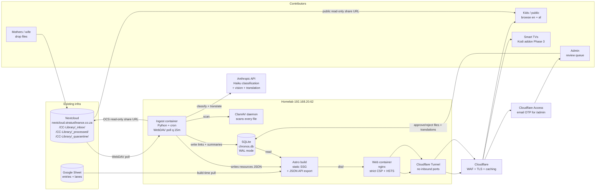

# Chronos — Architecture & Build Plan

> Status: **Plan v3 — security + future clients added.** Seventeen user decisions locked. Next action: scaffold the repo skeleton in a follow-up commit. **No application code yet.**

---

## 1. Executive summary

Chronos is a statically-generated, self-hosted, **bilingual (English + Afrikaans)** interactive timeline of biblical history with toggleable parallel lanes for Egypt, Rome, and (over time) other ancient civilisations, church history, science, and the arts. Each entry is a hub for curated learning resources auto-classified by Claude Haiku from files mothers drop into Nextcloud. **Security is first-class** (Cloudflare Access for admin, ClamAV scan on every uploaded file, strict CSP, container hardening, no third-party runtime JS). **Future-proofed for smart-TV and Kodi consumption** via a read-only JSON API in Phase 2 and a dedicated Kodi addon in Phase 3. Frontend is Astro 4 + vis-timeline island; backend is Python ingest + SQLite; hosted on the homelab behind a Cloudflare Tunnel.

---

## 2. Decisions locked

| # | Decision | Implication |
|---|---|---|
| 1 | **Chronology: Ussher** (Creation 4004 BC) primary | Schema carries `start_year_alt_json` for Masoretic / LXX alternates |
| 2 | **CC Fridge Facts: link only**, never copy text | CC files live in `files` table; our own AI paraphrase is the only stored text |
| 3 | **Domain: `chronos.stratusfinance.co.za`** | Standalone domain deferrable to Phase 3 |
| 4 | **MVP lanes: Egypt + Rome** from day one | Lane infrastructure designed for easy addition |
| 5 | **Bible text: ESV (English) once Crossway approves; KJV English placeholder; Afrikaans 1933/53 long-term** | One config flip switches English KJV → ESV |
| 6 | **AI budget: R20 / ~$1 per day (~140 files)** | Ingest halts at ceiling, resumes at midnight UTC |
| 7 | **Authoring: Google Sheet (Phase 1–2), admin web UI in Phase 3** | Sheet has `lanes` + `entries` tabs |
| 8 | **Bilingual (en + af) from day one** | Routes `/[lang]/...`, `lang` column on `entries`, Markdown front-matter carries `lang` |
| 9 | **Afrikaans wiki: AI drafts → admin review → publish** | Brief's "no AI on entry content" rule relaxed for translation only, gated by review |
| 10 | **Default language: landing-page picker once, remembered in localStorage** | One-time interstitial; URL is always the source of truth |
| 11 | **Update freshness: ~15 min via fast-path JSON rewrite, no full rebuild** | Full Astro rebuild only on entry/wiki/code changes + nightly |
| 12 | **Mobile + desktop equally polished from day one** | ~30% extra Phase 1 effort |
| 13 | **Future lane categories: civilisations, church history, science, arts** | `lanes.group_label` accommodates all four; no schema change to add them |
| 14 | **Admin auth: Cloudflare Access with email one-time PIN** | Allowlist managed in CF dashboard; no password to leak |
| 15 | **File safety: trust mothers, scan everything anyway (ClamAV)** | Every uploaded file scanned before processing; PDFs stripped of embedded JS; images re-encoded to strip EXIF |
| 16 | **TV strategy: TV-friendly site (Phase 1) + JSON API (Phase 2) + dedicated Kodi addon (Phase 3)** | API-first foundation; Kodi addon as a real Phase 3 deliverable in a separate repo |
| 17 | **No audit log table** | Trust git history (Markdown + sheet exports) + nightly DB backups for forensics |

---

## 3. Architecture diagram



---

## 4. Repo structure

```
chronos/                              this repo
├── PLAN.md
├── README.md
├── SECURITY.md                       responsible disclosure + threat model summary
├── .env.example
├── docker-compose.yml
├── .github/workflows/                CI: typecheck, schema validate, build, dep audit
│
├── apps/
│   ├── site/                         Astro 4 project
│   │   ├── astro.config.mjs          CSP headers, sanitize rehype config
│   │   ├── tailwind.config.cjs
│   │   ├── src/
│   │   │   ├── pages/
│   │   │   │   ├── index.astro       language picker landing
│   │   │   │   ├── [lang]/...        bilingual site tree
│   │   │   │   └── api/v1/           Phase 2: static JSON API endpoints
│   │   │   ├── layouts/
│   │   │   ├── components/
│   │   │   │   ├── timeline/         vis-timeline island
│   │   │   │   ├── resources/        fast-path JSON fetcher island
│   │   │   │   ├── lang/             landing picker, in-page switcher
│   │   │   │   └── ui/               static components, bilingual chrome
│   │   │   ├── content/wiki/{en,af}/{slug}.md
│   │   │   ├── i18n/{en,af}.json     UI strings
│   │   │   ├── lib/                  dates, db reader, i18n, sanitize
│   │   │   └── styles/               includes tv-mode.css (Phase 1)
│   │   ├── public/
│   │   └── scripts/
│   │       ├── pull-sheet.ts
│   │       └── validate-schema.ts
│   │
│   └── ingest/                       Python ingest service
│       ├── pyproject.toml
│       ├── chronos_ingest/
│       │   ├── main.py
│       │   ├── config.py             pydantic-settings
│       │   ├── nextcloud.py          WebDAV + OCS shares (read-only, no listing)
│       │   ├── scan.py               ClamAV client + pikepdf JS-stripper + Pillow re-encode
│       │   ├── extract.py            pdfplumber, Pillow, ffprobe
│       │   ├── classify.py           Haiku classification + prompt cache + moderation prompt
│       │   ├── translate.py          en → af for wiki + file summaries
│       │   ├── db.py                 SQLite writer, parameterized queries only
│       │   ├── rebuild.py            fast-path JSON / full rebuild
│       │   ├── admin_api.py          FastAPI, verifies CF Access JWT on every request
│       │   ├── webhook.py            Apps Script webhook, HMAC-verified
│       │   └── budget.py
│       ├── tests/
│       └── Dockerfile                non-root, distroless base
│
├── db/
│   ├── migrations/                   numbered SQL files
│   └── seed/
│
├── docs/
│   ├── chronology.md
│   ├── content-pipeline.md
│   ├── translation-pipeline.md
│   ├── security.md                   detailed threat model + controls
│   ├── api.md                        JSON API spec (Phase 2)
│   └── copyright.md
│
└── scripts/
    ├── backup-db.sh                  nightly SQLite backup, gpg-encrypted, offsite rsync
    ├── restore-drill.sh              quarterly restore verification
    └── dev.sh

chronos-kodi/                         separate repo (Phase 3)
├── addon.xml
├── default.py                        Kodi addon entry point
├── lib/
│   ├── api.py                        consumes /api/v1/...
│   ├── windows/
│   └── settings.xml
└── resources/
```

---

## 5. Database schema (SQLite, WAL)

```sql
PRAGMA journal_mode = WAL;
PRAGMA foreign_keys = ON;

CREATE TABLE lanes (
  id              INTEGER PRIMARY KEY,
  slug            TEXT NOT NULL UNIQUE,
  label_en        TEXT NOT NULL,
  label_af        TEXT,
  colour          TEXT NOT NULL,
  group_label     TEXT NOT NULL,                   -- 'biblical','empires','church-history',
                                                    -- 'science','arts','modern'
  default_visible INTEGER NOT NULL DEFAULT 1,
  base_layer      INTEGER NOT NULL DEFAULT 0,
  sort_order      INTEGER NOT NULL DEFAULT 0
);

CREATE TABLE entries (
  id                  INTEGER PRIMARY KEY,
  slug                TEXT NOT NULL UNIQUE,
  type                TEXT NOT NULL CHECK (type IN ('person','event','period','prophecy')),
  lane_id             INTEGER NOT NULL REFERENCES lanes(id),
  start_year          INTEGER NOT NULL,
  end_year            INTEGER,
  display_dates_en    TEXT NOT NULL,
  display_dates_af    TEXT,
  importance          INTEGER NOT NULL DEFAULT 3 CHECK (importance BETWEEN 1 AND 5),
  parent_period_slug  TEXT REFERENCES entries(slug),
  scripture_refs_json TEXT,
  artwork_url         TEXT,
  artwork_credit      TEXT,
  start_year_alt_json TEXT,
  chronology_note_en  TEXT,
  chronology_note_af  TEXT,
  created_at          TEXT NOT NULL DEFAULT (datetime('now')),
  updated_at          TEXT NOT NULL DEFAULT (datetime('now'))
);
CREATE INDEX idx_entries_lane ON entries(lane_id);
CREATE INDEX idx_entries_year ON entries(start_year, end_year);
CREATE INDEX idx_entries_importance ON entries(importance);

CREATE TABLE entry_translations (
  entry_id            INTEGER NOT NULL REFERENCES entries(id) ON DELETE CASCADE,
  lang                TEXT NOT NULL CHECK (lang IN ('en','af')),
  title               TEXT NOT NULL,
  summary             TEXT NOT NULL,
  wiki_md             TEXT,
  translation_status  TEXT NOT NULL DEFAULT 'authored'
                      CHECK (translation_status IN ('authored','ai_draft','reviewed','published')),
  source_lang         TEXT,
  ai_draft_at         TEXT,
  reviewed_at         TEXT,
  reviewed_by         TEXT,
  PRIMARY KEY (entry_id, lang)
);
CREATE INDEX idx_translations_status ON entry_translations(translation_status)
  WHERE translation_status IN ('ai_draft','reviewed');

CREATE TABLE files (
  id              INTEGER PRIMARY KEY,
  nextcloud_path  TEXT NOT NULL UNIQUE,
  public_url      TEXT,
  file_type       TEXT NOT NULL CHECK (file_type IN ('pdf','video','audio','image','doc')),
  title           TEXT NOT NULL,
  size_bytes      INTEGER,
  duration_seconds INTEGER,
  extracted_text  TEXT,
  ai_summary_en   TEXT,
  ai_summary_af   TEXT,
  cc_cycle        INTEGER,
  cc_week         INTEGER,
  age_min         INTEGER,
  age_max         INTEGER,
  scan_result     TEXT,                            -- 'clean','infected','suspicious','error'
  scan_signatures TEXT,                            -- ClamAV signature names if flagged
  moderation_flag INTEGER NOT NULL DEFAULT 0,      -- 1 if AI vision flagged content
  processed_at    TEXT,
  status          TEXT NOT NULL DEFAULT 'pending'
                  CHECK (status IN ('pending','processed','needs_review','quarantined','failed')),
  error_message   TEXT
);
CREATE INDEX idx_files_status ON files(status);
CREATE INDEX idx_files_type ON files(file_type);

CREATE TABLE links (
  id            INTEGER PRIMARY KEY,
  entry_id      INTEGER NOT NULL REFERENCES entries(id) ON DELETE CASCADE,
  file_id       INTEGER NOT NULL REFERENCES files(id) ON DELETE CASCADE,
  confidence    REAL NOT NULL CHECK (confidence BETWEEN 0 AND 1),
  source        TEXT NOT NULL CHECK (source IN ('auto','manual')),
  reason        TEXT,
  needs_review  INTEGER NOT NULL DEFAULT 0,
  created_at    TEXT NOT NULL DEFAULT (datetime('now')),
  confirmed_at  TEXT,
  confirmed_by  TEXT,
  UNIQUE (entry_id, file_id)
);
CREATE INDEX idx_links_entry ON links(entry_id, confidence DESC);
CREATE INDEX idx_links_review ON links(needs_review) WHERE needs_review = 1;

CREATE TABLE related_entries (
  entry_id          INTEGER NOT NULL REFERENCES entries(id) ON DELETE CASCADE,
  related_entry_id  INTEGER NOT NULL REFERENCES entries(id) ON DELETE CASCADE,
  relationship_type TEXT NOT NULL CHECK (relationship_type IN
                    ('parent','child','references','fulfils_prophecy','fulfilled_by')),
  PRIMARY KEY (entry_id, related_entry_id, relationship_type)
);

CREATE TABLE bible_verses (
  translation     TEXT NOT NULL CHECK (translation IN ('kjv','esv','af1933')),
  book            TEXT NOT NULL,
  chapter         INTEGER NOT NULL,
  verse           INTEGER NOT NULL,
  text            TEXT NOT NULL,
  PRIMARY KEY (translation, book, chapter, verse)
);

CREATE TABLE failed_imports (
  id              INTEGER PRIMARY KEY,
  nextcloud_path  TEXT NOT NULL,
  error_message   TEXT NOT NULL,
  attempted_at    TEXT NOT NULL DEFAULT (datetime('now')),
  retry_count     INTEGER NOT NULL DEFAULT 0
);

CREATE TABLE usage (
  id              INTEGER PRIMARY KEY,
  day             TEXT NOT NULL UNIQUE,
  haiku_calls     INTEGER NOT NULL DEFAULT 0,
  haiku_input_tokens  INTEGER NOT NULL DEFAULT 0,
  haiku_output_tokens INTEGER NOT NULL DEFAULT 0,
  haiku_cost_usd  REAL NOT NULL DEFAULT 0
);
```

New (vs v2) for security: `files.scan_result`, `files.scan_signatures`, `files.moderation_flag`, `files.status='quarantined'`.

---

## 6. Astro project structure

**Routing:** all visible pages live under `/[lang]/...`. Root `/` is a one-time language picker. `/admin/*` is the only runtime route, behind Cloudflare Access. Phase 2 adds `/api/v1/*` as **static** JSON endpoints (no runtime server).

**Pages (static):**
```
/                                language picker landing
/[lang]/                         home
/[lang]/timeline                 canvas-driven view
/[lang]/entry/[slug]             prerendered
/[lang]/era/[slug]               period landing
/[lang]/lane/[slug]              all entries in one lane
/[lang]/about                    incl. "what we collect" note
/admin/review                    Cloudflare Access only
/api/v1/lanes.json               Phase 2 — static
/api/v1/entries.json             Phase 2 — static, full list
/api/v1/entries/{slug}.json      Phase 2 — written per-entry
/api/v1/entries/{slug}/resources.json   already used by site, public Phase 2
404
```

**Markdown safety:** wiki Markdown is rendered through `rehype-sanitize` with the default safe schema — **no raw HTML allowed**. If we ever need richer markup, we'll allowlist specific tags explicitly. Inline scripture is rendered from typed JSON, not from Markdown HTML, so a hostile wiki author can't inject script into verse rendering.

**TV-friendly mode (Phase 1):**
- `tv-mode.css` triggered by `?tv=1` query param, by viewport ≥ 1280px + `pointer:coarse`, or by `localStorage.tvMode = true`.
- Larger fonts (1.5x base), thicker focus outlines, no hover-only behaviours, generous spacing.
- Arrow keys + Enter navigation across every interactive control (also needed for accessibility — synergy).
- A `/tv` route renders an even simpler "lean-back" view: vertical era-by-era list with hero artwork, designed for sofa viewing.

**Date helper:** unchanged from v2.

---

## 7. Python ingest structure

**Entry points:** `python -m chronos_ingest` (cron) and `chronos_ingest.admin_api` (FastAPI under uvicorn).

**Modules:**
- `config.py` — pydantic-settings, env-driven.
- `nextcloud.py` — WebDAV listing of `_inbox/`, downloads, moves to `_processed/` or `_quarantine/`, OCS share creation **with permission=1 (read-only, no listing)**.
- `scan.py` — ClamAV `clamd` Unix-socket client. PDFs additionally piped through `pikepdf` to strip embedded JS and external links. Images re-encoded via Pillow (strips EXIF including GPS). Returns `(ok: bool, signatures: list[str], notes: str)`.
- `extract.py` — pdfplumber (~3000 chars), pdf2image (thumbnail), Pillow, ffprobe.
- `classify.py` — single Haiku call per file. Prompt-cached entry-list block. Prompt includes a moderation directive: "If the file appears age-inappropriate for children or contains gratuitous violence/nudity, set `moderation_flag=true` and explain." Confidence thresholds: ≥0.7 auto, 0.5–0.7 review, <0.5 discard.
- `translate.py` — separate Haiku call per English wiki article → Afrikaans draft → `entry_translations` with `translation_status='ai_draft'`. Same for `ai_summary_en` → `ai_summary_af`.
- `db.py` — sole SQLite writer; **all queries parameterized** (no string concat). Single transaction per file. Idempotent on `nextcloud_path`.
- `rebuild.py` — fast-path JSON rewrite for affected entries; full rebuild only on entry/wiki change or nightly.
- `budget.py` — checks `usage` table before each Haiku call; halts at `DAILY_HAIKU_BUDGET_USD`.
- `webhook.py` — Apps Script → ingest. Body signed with HMAC-SHA256; secret in env (`WEBHOOK_HMAC_SECRET`). Rejects unsigned or stale (>5 min) requests.
- `admin_api.py` — FastAPI behind Cloudflare Access. **Verifies CF Access JWT on every request** using the `CF_ACCESS_TEAM` + `CF_ACCESS_AUD` env vars — does not trust the proxy alone. All bodies are pydantic-validated. Endpoints:
  - `GET  /admin/review/files`, `POST /admin/review/files/{link_id}/{confirm|reject}`
  - `POST /admin/files/{file_id}/link`
  - `GET  /admin/review/quarantine` (scan-flagged + moderation-flagged files)
  - `POST /admin/review/quarantine/{file_id}/{release|delete}`
  - `GET  /admin/review/translations`, `POST .../{entry_id}/{approve|edit|reject}`

---

## 8. Build / deploy flow

- **Code change → site:** push `main` → GitHub Actions (typecheck, Zod validate, `npm audit`, `pip-audit`, `astro build` covering `/en/`, `/af/`, and `/api/v1/`) → Docker image (pinned by digest) → homelab `docker compose up -d web`.
- **Sheet edit → site:** Apps Script `onEdit` → HMAC-signed webhook to ingest → re-pull + validate → write rows → full Astro rebuild.
- **Nextcloud upload → site (common case):** mother drops file → cron tick (≤15 min) → ClamAV scan → if clean, extract + classify + write links → ingest rewrites only `dist/data/entries/{slug}.json` (and `/api/v1/entries/{slug}.json` in Phase 2). nginx serves immediately. **No Astro rebuild.**
- **Scan failure:** file moved to `_quarantine/` in Nextcloud, `files.status='quarantined'`, surfaces in admin queue. Never publicly shared.
- **Afrikaans review approval → site:** admin clicks approve → DB write → fast-path JSON rewrite.
- **Nightly:** full Astro rebuild + SQLite `.backup` + `gpg --encrypt` + offsite rsync.

---

## 9. Environment variables

| Var | Lives | Used by |
|---|---|---|
| `NEXTCLOUD_URL` | ingest | nextcloud.py |
| `NEXTCLOUD_USER` | ingest (secret) | nextcloud.py |
| `NEXTCLOUD_APP_PASSWORD` | ingest (secret) | nextcloud.py |
| `NEXTCLOUD_INBOX_PATH` | ingest | nextcloud.py |
| `NEXTCLOUD_PROCESSED_PATH` | ingest | nextcloud.py |
| `NEXTCLOUD_QUARANTINE_PATH` | ingest | nextcloud.py |
| `ANTHROPIC_API_KEY` | ingest (secret) | classify.py, translate.py, extract.py |
| `ANTHROPIC_MODEL` | ingest, default `claude-haiku-4-5-20251001` | classify.py, translate.py |
| `DAILY_HAIKU_BUDGET_USD` | ingest, default `1.00` (~R20) | budget.py |
| `SQLITE_PATH` | both containers | shared mounted volume |
| `ASTRO_DIST_PATH` | ingest + web | rebuild.py |
| `REBUILD_WEBHOOK_URL` | ingest | rebuild.py |
| `GOOGLE_SHEET_ID` | site + ingest | pull-sheet.ts |
| `GOOGLE_SHEETS_SA_JSON` | secret | pull-sheet.ts |
| `ADMIN_API_BIND` | ingest | admin_api.py |
| `CLOUDFLARE_TUNNEL_TOKEN` | tunnel (secret) | cloudflared |
| `CF_ACCESS_TEAM` | ingest, e.g. `stratusfinance` | admin_api.py JWT verification |
| `CF_ACCESS_AUD` | ingest (secret) | admin_api.py JWT verification |
| `WEBHOOK_HMAC_SECRET` | ingest + Apps Script (secret) | webhook.py |
| `CLAMAV_SOCKET` | ingest, default `/var/run/clamav/clamd.sock` | scan.py |
| `BACKUP_GPG_RECIPIENT` | backup script | backup-db.sh |
| `BACKUP_OFFSITE_RSYNC_TARGET` | backup script (secret) | backup-db.sh |
| `SITE_BASE_URL` | site build, `https://chronos.stratusfinance.co.za` | OG tags, sitemap |
| `DEFAULT_LANG` | site build, default `en` | i18n fallback |
| `ENGLISH_BIBLE` | site build, `kjv` initially → `esv` after approval | ScriptureRefs |

Secrets live in `.env` on the homelab (chmod 600), never committed. CI uses GitHub Actions secrets (separate from production keys where possible). `.env.example` documents shape only.

---

## 10. Container topology

```yaml
services:
  web:
    image: chronos/site@sha256:...     # pinned by digest, no 'latest'
    read_only: true
    cap_drop: [ALL]
    security_opt: ["no-new-privileges:true"]
    user: "1000:1000"
    volumes:
      - ./dist:/usr/share/nginx/html:ro
      - nginx-cache:/var/cache/nginx
      - nginx-run:/var/run
    networks: [chronos]

  ingest:
    image: chronos/ingest@sha256:...
    read_only: true
    cap_drop: [ALL]
    security_opt: ["no-new-privileges:true"]
    user: "1000:1000"
    environment: [...]
    volumes:
      - ./db:/data/db
      - ./dist:/data/dist
      - ingest-tmp:/tmp                # writable scratch for downloads
      - /var/run/clamav:/var/run/clamav:ro
    depends_on: [clamav]
    networks: [chronos]
    restart: unless-stopped

  clamav:
    image: clamav/clamav@sha256:...
    volumes:
      - clamav-db:/var/lib/clamav
      - /var/run/clamav:/var/run/clamav
    networks: [chronos]
    restart: unless-stopped

  cloudflared:
    image: cloudflare/cloudflared@sha256:...
    command: tunnel --no-autoupdate run
    environment:
      - TUNNEL_TOKEN=${CLOUDFLARE_TUNNEL_TOKEN}
    networks: [chronos]

volumes:
  nginx-cache:
  nginx-run:
  ingest-tmp:
  clamav-db:

networks:
  chronos:
```

Notes:
- All images pinned by SHA-256 digest. Watchtower disabled — updates are deliberate, via Dependabot PRs.
- Containers run as UID 1000, read-only root filesystem, all capabilities dropped, no privilege escalation.
- nginx serves with strict security headers (configured in image): `Content-Security-Policy`, `Strict-Transport-Security`, `X-Frame-Options: DENY`, `X-Content-Type-Options: nosniff`, `Referrer-Policy: strict-origin-when-cross-origin`, `Permissions-Policy` (deny camera/mic/geolocation).

---

## 11. Phase 1 task list (~35–45h over 3–4 weekends)

| # | Task | Effort |
|---|---|---|
| 1 | Repo scaffold (folders, configs, `.env.example`, docker-compose stub, SECURITY.md) | 1h |
| 2 | SQLite migrations `0001_init.sql` + seed lanes (4 lanes: Bible-Events, Bible-People, Egypt, Rome) | 1.5h |
| 3 | Google Sheet schema + 30 English entries (Adam → Christ) | 3h |
| 4 | `pull-sheet.ts` + Zod validation (bilingual-aware) | 2h |
| 5 | Astro layout, Tailwind theme tokens, fonts, palette | 2h |
| 6 | i18n loader, `/[lang]/` routing, language picker landing, in-page switcher | 2h |
| 7 | Static `/[lang]/entry/[slug]` — wiki + scripture refs (KJV / 1933-53) | 2.5h |
| 8 | Era / lane index pages, both languages | 1h |
| 9 | `TimelineCanvas` desktop island (vis-timeline, BC formatter, lane toggles, URL state) | 4h |
| 10 | `MobileTimelineAccordion` (equal-polish mobile view) | 3h |
| 11 | Pre-zoom buttons + label-density rules | 1.5h |
| 12 | Accessibility: parallel `<table>` view, keyboard nav, ARIA on markers | 2h |
| 13 | **TV-friendly mode (`tv-mode.css`, `/tv` route, remote-friendly nav)** | 2h |
| 14 | Load KJV + Afrikaans 1933/53 into `bible_verses` (one-time import) | 1.5h |
| 15 | Wiki Markdown for 30 seed entries (English, manual) | 3h |
| 16 | Translate 30 entries to Afrikaans via Haiku draft → manual review/edit | 4h |
| 17 | Manually-curated resource links from sheet → static resources panel | 1.5h |
| 18 | Wikimedia artwork sourcing + attribution capture for 30 entries | 2h |
| 19 | Minimal `/admin/review` placeholder route (full UI in Phase 2) | 1h |
| 20 | **Security hardening: CSP + security headers in nginx config; `rehype-sanitize` config; CI dep audit; container hardening; backup script + first restore drill** | 3h |
| 21 | Deploy: pinned-digest image, homelab, Cloudflare Tunnel + Access policy for `/admin/*`, smoke test on phone + laptop + actual TV browser | 2.5h |

Phase 1 excludes: Nextcloud ingest pipeline, AI classification, ClamAV (it's in compose but used in Phase 2), full admin UI, JSON API, FTS5 search, Kodi addon.

---

## 12. Phase 2 + Phase 3 scope

**Phase 2 (~2 weekends):**
- Python ingest for PDFs and images.
- **ClamAV scanning + PDF JS stripping + image EXIF re-encode (`scan.py`)**.
- Haiku classification with confidence thresholds, prompt caching, daily budget guard, moderation flag.
- `translate.py` for English-wiki → Afrikaans-draft.
- Nextcloud OCS read-only share-link generation.
- **Full admin review UI**: file links, quarantine, translation drafts (promoted from Phase 3).
- Fast-path JSON rewrite mechanism wired in.
- HMAC-signed sheet webhook.
- **Public JSON API at `/api/v1/...`** — static files, written at build time and updated by the fast-path. Documented in `docs/api.md`. CORS-open for GET. Cached at Cloudflare edge.

**Phase 3 (~2–3 weekends):**
- SQLite FTS5 search across both languages, exposed via site search bar and `/api/v1/search`.
- Whisper.cpp for video transcripts (improves classification of video content).
- Additional lane data: church history (Reformation, councils, missions), science / invention, art / literature / music.
- **`chronos-kodi` addon repo** — Kodi Matrix-compatible addon consuming `/api/v1/*`. Browse by era / lane, play videos via Nextcloud share URLs, settings for language. Published as a zip; users install via "Install from zip" in Kodi.
- ESV switchover once Crossway approves (config flip + bible_verses import).
- Lightweight authoring web UI to replace the Google Sheet.
- Standalone domain migration if desired.

---

## 13. Risk register

| # | Risk | Likelihood | Impact | Mitigation |
|---|---|---|---|---|
| 1 | vis-timeline BC-axis rendering fights us | M | M | Date-helper boundary; mobile accordion is an alternative; budget D3+SVG swap in Phase 3 |
| 2 | Haiku misclassifies CC files (wrong cycle/week) | M | L | Filename pattern parser runs before LLM; LLM authoritative only when filename empty |
| 3 | CC copyright complaint | L | M | Link-only policy; immediate-delete playbook in `docs/copyright.md` |
| 4 | SQLite corruption from concurrent writes | L | H | WAL, sole writer, read-only web, nightly encrypted backup + offsite rsync |
| 5 | Anthropic API outage stalls ingest | M | L | Files stay in `_inbox/`, retried next tick; no user-facing impact |
| 6 | Doctrinally questionable AI-translated Afrikaans escapes review | M | H | All AI Afrikaans through admin review queue; visible "translation pending" badge |
| 7 | **Malicious file uploaded to Nextcloud reaches kids** | L | H | ClamAV scan + PDF JS strip + image re-encode + AI moderation flag; quarantine + admin review |
| 8 | **Admin email account compromised → unauthorized review-queue actions** | L | H | CF Access OTP requires access to email at each login; no persistent passwords; promptly remove email from CF Access if compromised |
| 9 | **XSS via hostile Markdown in wiki content** | L | M | `rehype-sanitize` default-safe schema, no raw HTML; strict CSP blocks inline scripts; CSP report-only initially to catch surprises |
| 10 | **Supply-chain attack via npm or pip dependency** | M | M | Lock files committed; Dependabot weekly; `npm audit` + `pip-audit` fail CI on high/critical; pinned Docker digests |
| 11 | **Cloudflare Tunnel token leaked** | L | H | Token in `.env` chmod 600; rotate quarterly; revoke immediately on suspected leak (CF dashboard); no token in CI |
| 12 | **Backup leak (DB contains email addresses of admins, AI summaries of file contents)** | L | M | Backups gpg-encrypted before leaving the homelab; recipient key stored offline |
| 13 | ESV licence denied | L | M | KJV remains valid indefinitely; no architectural impact |
| 14 | Afrikaans authoring effort exceeds estimate | M | M | Translation badge means English-first launch; Afrikaans fills in over time |
| 15 | **Kodi addon API breakage** (Phase 3) | M | L | JSON API versioned (`/api/v1/`); addon pins API version; future `/api/v2/` won't break old addons |
| 16 | Build time grows past acceptable past 200 entries × 2 languages | M | L | Astro parallelises; fast-path JSON avoids most rebuilds |

---

## 14. Security architecture (detail)

Spelt out because it's a first-class concern, not an afterthought.

**Network & transport**
- Cloudflare Tunnel: zero inbound ports open on the homelab.
- TLS terminated at Cloudflare edge with automatic HSTS preload.
- Cloudflare free WAF rules enabled (covers common OWASP attack patterns).
- nginx in container enforces `Strict-Transport-Security` independently (defence in depth).

**Authentication & authorisation**
- Public site: **no authentication anywhere**. Therefore no attack surface for credential abuse.
- Admin (`/admin/*`): Cloudflare Access with email OTP. Allowlist of email addresses managed in the CF dashboard. Sessions are CF-managed JWTs.
- `admin_api.py` verifies the `CF-Access-Jwt-Assertion` header on every request against Cloudflare's public keys — does not trust the proxy alone (defence in depth).
- Apps Script webhook → ingest: HMAC-SHA256 body signature with shared secret. Stale requests (>5 min) rejected.

**Application — frontend (Astro)**
- Strict Content-Security-Policy: `default-src 'self'; script-src 'self' 'sha256-...'; style-src 'self' 'unsafe-inline'; img-src 'self' data: https://nextcloud.stratusfinance.co.za https://commons.wikimedia.org; media-src 'self' https://nextcloud.stratusfinance.co.za; frame-ancestors 'none'; base-uri 'self'; form-action 'self';`
- Markdown rendering: `rehype-sanitize` with the default safe schema. **No raw HTML** in wiki content.
- Scripture text rendered from typed JSON, not from Markdown HTML.
- No third-party JS at runtime. No analytics scripts. If we want stats later, use a first-party log aggregator like GoatCounter self-hosted.
- localStorage contents: `lang`, `favourites[]`, `tvMode`. No PII. Documented in `/about`.

**Application — backend (Python ingest)**
- All SQLite queries parameterised. No string concatenation in SQL.
- All admin API request bodies validated via pydantic models. Unknown fields rejected (`extra="forbid"`).
- No `eval`, no `exec`, no `subprocess.shell=True`. `ffprobe` invoked with `subprocess.run([...], shell=False)` and a strict argv allowlist.
- Anthropic API key only ever read server-side. Never forwarded to clients.

**File pipeline (the highest-risk surface)**
- Every file scanned by ClamAV daemon before any other processing. Infected → `_quarantine/`, `status='quarantined'`, never shared.
- PDFs additionally piped through `pikepdf` to strip `/JavaScript`, `/JS`, `/OpenAction`, and external `/URI` references. Cuts the PDF-as-malware vector.
- Images re-encoded through Pillow before share-link creation. Strips EXIF (including GPS coordinates a mother's phone may have embedded), drops any non-pixel chunks. Bonus: normalises format.
- Videos and audio not re-encoded (too expensive); served via Nextcloud share. Never executed server-side.
- Nextcloud OCS share links created with `permissions=1` (read-only, no upload, no re-share) and `hide_download=false`. Folder shares disabled — only specific-file shares are generated.
- AI vision call on every image includes a moderation directive: flagged images get `moderation_flag=1` and surface in admin quarantine even if ClamAV cleared them.

**Container hardening**
- Images pinned by SHA-256 digest. No `latest`.
- Containers run as UID 1000, not root.
- Read-only root filesystem. Writable volumes only for `/data/db`, `/data/dist`, `/tmp`.
- `cap_drop: [ALL]`, `security_opt: ["no-new-privileges:true"]`.
- CPU and memory limits set in compose to bound any runaway process.

**Secrets management**
- `.env` on the homelab, chmod 600, owned by the docker user, never committed.
- Rotate `ANTHROPIC_API_KEY`, `NEXTCLOUD_APP_PASSWORD`, `CLOUDFLARE_TUNNEL_TOKEN`, `WEBHOOK_HMAC_SECRET` quarterly. Calendar reminder.
- GitHub Actions uses separate (read-only Nextcloud, lower-budget Anthropic) keys for CI tests where possible.
- `.env.example` documents every variable's shape — never values.

**Dependencies**
- Lock files committed (`package-lock.json`, `uv.lock`).
- Dependabot weekly PRs for npm + pip + GitHub Actions + Docker.
- CI: `npm audit --audit-level=high`, `pip-audit --strict`, both fail-the-build.
- Minimal dependency footprint: Astro core, Tailwind, vis-timeline, Zod, rehype-sanitize for the frontend; FastAPI, pdfplumber, pikepdf, Pillow, anthropic, ffmpeg-python, webdavclient3, clamd-py for the backend.

**Backups & integrity**
- Nightly `sqlite3 .backup` → `db/backups/chronos-YYYY-MM-DD.db`.
- Encrypted with `gpg --encrypt` to a recipient key whose private half lives offline.
- 30-day retention locally, rsync to offsite target weekly.
- Quarterly restore drill: `scripts/restore-drill.sh` un-tars a recent backup into a scratch DB and verifies entry counts.

**Children's safety**
- AI translation prompt explicitly forbids adding content not present in source. Admin review gates publication.
- AI vision moderation flag on every image. Flagged images quarantined.
- No third-party iframes at runtime. No YouTube embeds by default — videos served from Nextcloud share. If a YouTube embed is ever needed, `<iframe sandbox="allow-scripts allow-same-origin">` and CSP `frame-src` allowlist.

**Data protection (POPIA awareness — you're South African)**
- Public site collects no PII. No accounts, no analytics, only client-side localStorage preferences.
- Admin login captures email (Cloudflare Access). That's the only PII handled.
- No cookie banner legally required (no tracking cookies set).
- `/about` and `/[lang]/about` document precisely what is and isn't collected.

**Disclosure & monitoring**
- `SECURITY.md` in repo root: how to report a vulnerability (email + GPG key fingerprint).
- nginx access logs retained 30 days locally; not shipped offsite (no PII to gain by reviewing them, and they contain visitor IPs).
- CF Access login events visible in the Cloudflare dashboard if a forensic question ever arises.

---

## 15. Future client surfaces (TV, API, Kodi)

The point of the JSON API is to keep adding clients cheap. Phase plan:

**Phase 1 — TV-browsable site.** `tv-mode.css` + `/tv` lean-back route + arrow-key navigation. Any smart TV with a browser (LG WebOS, Samsung Tizen, Android TV Chrome) can use Chronos today.

**Phase 2 — Public JSON API at `/api/v1/`.** Static JSON files generated at build time, refreshed by the fast-path during file ingest. Read-only, no auth, CORS-open, cached at the Cloudflare edge.

```
GET /api/v1/lanes.json
GET /api/v1/entries.json                              (compact list)
GET /api/v1/entries/{slug}.json?lang=en               (full entry incl. wiki Markdown)
GET /api/v1/entries/{slug}/resources.json             (resources panel data)
GET /api/v1/eras.json                                 (period entries flagged as eras)
GET /api/v1/search.json?q=...&lang=en                 (Phase 3, FTS5-backed)
```

API versioning: the `/v1` prefix is a commitment. Breaking changes go to `/v2`; `/v1` stays alive for at least one major version of any client (e.g. Kodi addon).

Rate limiting: Cloudflare WAF rule, 1000 req/hour per IP — generous enough for legitimate clients, low enough to suffocate scrapers.

**Phase 3 — `chronos-kodi` addon, separate repo.**
- Python 3, Kodi Matrix-compatible (v19+).
- Consumes `/api/v1/*` only — no scraping.
- Windows: era list → entries → entry detail with resources.
- Plays video resources directly via Nextcloud share URLs.
- Settings: language (en/af), API base URL, default era.
- Distribution: GitHub releases as `.zip`, install via Kodi's "Install from zip". Not pursuing the official Kodi addon repository in Phase 3 (high process overhead for a niche addon); revisit if there's demand.

Future surfaces enabled by the API at zero marginal infra cost: Android TV native, iOS app, Apple TV app, e-paper companion display, Roku channel, Home Assistant card. None are committed.

---

## 16. Considered and rejected

- **Next.js + ISR.** Runtime server we don't need; static + fast-path JSON achieves the same outcome.
- **Postgres + pgvector + embeddings.** Direct Haiku classification with prompt caching is simpler and cheaper.
- **Full custom D3+SVG canvas in Phase 1.** vis-timeline + custom formatter ships earlier. Phase 3 swap if it hits a wall.
- **n8n / Temporal / Airflow.** Cron + Python script isn't a workflow problem.
- **A real CMS.** Google Sheet + Markdown PRs is simpler and versioned.
- **PDF.js custom build.** Prebuilt viewer iframe is enough.
- **Whisper.cpp in Phase 1.** Deferred to Phase 3.
- **Per-kid accounts.** localStorage favourites are sufficient.
- **Auto-publishing AI Afrikaans translations.** Review queue is the gate.
- **Hold Phase 1 launch for ESV licence.** KJV is a valid stand-in.
- **No language prefix in URLs.** `/[lang]/...` everywhere keeps SEO and sharing unambiguous.
- **Audit log table.** Per your call — git history + DB backups carry the same information for our scale.
- **Hardware-key admin auth (YubiKey).** Overkill for kids' learning content. CF Access OTP is the right level.
- **Building a Kodi addon in Phase 1.** Two codebases too early. API in Phase 2 keeps the option open at low cost; addon arrives in Phase 3 with proper polish.
- **Pushing the Kodi addon to the official Kodi repository.** Process overhead vs niche addon. GitHub releases sufficient.
- **Self-hosted analytics in Phase 1.** No analytics at all is the safest default; can add GoatCounter (first-party, no cookies, no PII) later if curious about usage.
- **Watchtower for auto-updates.** Dependabot PRs + manual review beats silent auto-updates for an attack-surface-sensitive deployment.

---

## 17. Next step

All seventeen decisions are locked. I'll scaffold the repo skeleton on `claude/new-session-5fOED` in a follow-up commit:
- Folder structure per §4 (including empty `apps/site/`, `apps/ingest/`, `docs/`).
- `db/migrations/0001_init.sql` matching §5 (incl. `entry_translations`, `bible_verses`, `usage`, scan/moderation columns on `files`).
- Empty configs: `astro.config.mjs`, `tailwind.config.cjs`, `pyproject.toml`, `docker-compose.yml` (with security stanzas), nginx config skeleton with security headers.
- `.env.example` with every variable from §9.
- Seed for 4 lanes and the 6 `group_label` values.
- Empty `i18n/en.json` + `i18n/af.json`.
- Stubs for `docs/security.md`, `docs/copyright.md`, `docs/chronology.md`, `docs/translation-pipeline.md`, `docs/api.md`.
- `SECURITY.md` at repo root.
- `.github/workflows/ci.yml` with typecheck + Zod validate + `npm audit` + `pip-audit` placeholders.

**Still no application code.** Confirm to proceed, or push back on anything in this plan.
