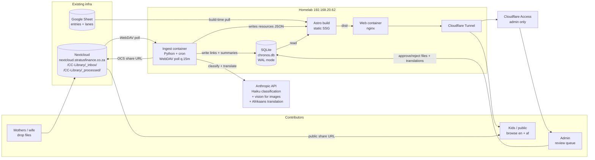

# Chronos — Architecture & Build Plan

> Status: **Plan v2 — decisions locked.** Thirteen open questions answered (§2). Pushback points 1–4 from v1 stand (technical recommendations, not user-facing); point 5 (chronology) is resolved by the decisions below.
>
> Next action: scaffold the repo skeleton in a follow-up commit. **No application code yet.**

---

## 1. Executive summary

Chronos is a statically-generated, self-hosted, **bilingual (English + Afrikaans)** interactive timeline of biblical history with toggleable parallel lanes for Egypt, Rome, and (over time) other ancient civilisations, church history, science, and the arts. Each entry (person, event, period, prophecy) is a hub for curated learning resources auto-classified by Claude Haiku from files mothers drop into Nextcloud. Frontend is Astro 4 (static + vis-timeline island). Backend is a Python ingest service + SQLite, on the homelab behind Cloudflare Tunnel. **Phase 1 (MVP)** is ~30 manually authored seed entries (Adam → Christ), two parallel lanes (Egypt + Rome), bilingual UI chrome, AI-drafted-then-reviewed Afrikaans translations, mobile + desktop polished equally.

---

## 2. Decisions locked

| # | Decision | Implication |
|---|---|---|
| 1 | **Chronology: Ussher** (Creation 4004 BC) as primary | Schema still carries `start_year_alt_json` for Masoretic / LXX alternates on contentious entries |
| 2 | **CC Fridge Facts: link only**, never copy text | CC files live in `files` table; our own AI paraphrase is the only stored text |
| 3 | **Domain: `chronos.stratusfinance.co.za`** | Uses existing Cloudflare setup; standalone domain deferrable |
| 4 | **MVP lanes: Egypt + Rome** (both from day one) | Lane infrastructure designed for easy addition of more |
| 5 | **Bible text: ESV (English) once Crossway approves; KJV English placeholder; Afrikaans 1933/53 long-term for the Afrikaans view** | One config flip switches English KJV → ESV. Afrikaans stays 1933/53. |
| 6 | **AI budget: R20 / ~$1 per day (~140 files)** | Ingest halts at ceiling, resumes at midnight UTC |
| 7 | **Authoring: Google Sheet (Phase 1–2), admin web UI in Phase 3** | Sheet has tabs for `lanes` and `entries`; new lane = new row |
| 8 | **Bilingual (en + af) from day one**, every page | Routes are `/[lang]/...`; `lang` column on `entries`; Markdown front-matter carries `lang` |
| 9 | **Afrikaans wiki: AI drafts → admin review → publish** | Brief's "no AI on entry content" rule is relaxed *only* for translation of already-vetted English, gated by admin review |
| 10 | **Default language: landing-page picker once, remembered in localStorage** | One-time interstitial on first visit; subsequent visits land directly in chosen language |
| 11 | **Update freshness: ~15 min via fast-path JSON rewrite, no full rebuild** | Full Astro rebuild only on entry/wiki/code changes, plus nightly safety net |
| 12 | **Mobile + desktop equally polished from day one** | ~30% extra effort in Phase 1; ships with vertical-accordion mobile + horizontal canvas desktop |
| 13 | **Future lane categories planned for: ancient civilisations, church history, science / invention, art / literature / music** | `lanes.group_label` accommodates all four; no schema change needed when these are added |

These decisions shift two things compared to v1:
- **Admin review queue moves from Phase 3 into Phase 2** (needed for Afrikaans translation review, not just file classification).
- **Phase 1 effort revises up from ~18–24h to ~30–40h** (mobile + desktop polish, bilingual chrome, Afrikaans authoring + review pass on 30 entries).

---

## 3. Architecture diagram



---

## 4. Repo structure

```
chronos/
├── PLAN.md
├── README.md
├── .env.example
├── docker-compose.yml
├── .github/workflows/                CI: typecheck, schema validate, build
│
├── apps/
│   ├── site/                         Astro 4 project
│   │   ├── astro.config.mjs
│   │   ├── tailwind.config.cjs
│   │   ├── src/
│   │   │   ├── pages/
│   │   │   │   ├── index.astro       language picker landing (no /[lang]/ prefix)
│   │   │   │   └── [lang]/
│   │   │   │       ├── index.astro
│   │   │   │       ├── timeline.astro
│   │   │   │       ├── entry/[slug].astro
│   │   │   │       ├── era/[slug].astro
│   │   │   │       ├── lane/[slug].astro
│   │   │   │       └── about.astro
│   │   │   ├── layouts/
│   │   │   ├── components/
│   │   │   │   ├── timeline/         vis-timeline island (BC-safe Date helpers)
│   │   │   │   ├── resources/        fast-path JSON fetcher island
│   │   │   │   ├── lang/             landing picker, in-page lang switcher
│   │   │   │   └── ui/               static components, bilingual chrome
│   │   │   ├── content/
│   │   │   │   └── wiki/
│   │   │   │       ├── en/{slug}.md
│   │   │   │       └── af/{slug}.md
│   │   │   ├── i18n/
│   │   │   │   ├── en.json           UI strings
│   │   │   │   └── af.json           UI strings
│   │   │   ├── lib/                  date helpers, db reader, i18n loader
│   │   │   └── styles/
│   │   ├── public/
│   │   └── scripts/
│   │       ├── pull-sheet.ts         Google Sheet → entries.json + lanes.json
│   │       └── validate-schema.ts    Zod validation, fails build on bad data
│   │
│   └── ingest/                       Python ingest service
│       ├── pyproject.toml
│       ├── chronos_ingest/
│       │   ├── main.py               cron entry point
│       │   ├── config.py             pydantic-settings
│       │   ├── nextcloud.py          WebDAV + OCS shares
│       │   ├── extract.py            pdfplumber, Pillow, ffprobe
│       │   ├── classify.py           Haiku classification + prompt cache
│       │   ├── translate.py          en → af for wiki articles, queued for review
│       │   ├── db.py                 SQLite writer (sole writer, WAL)
│       │   ├── rebuild.py            fast-path JSON / full rebuild
│       │   ├── admin_api.py          FastAPI /admin/review (files + translations)
│       │   └── budget.py             daily Haiku spend tracker
│       ├── tests/
│       └── Dockerfile
│
├── db/
│   ├── migrations/                   numbered SQL files
│   └── seed/                         lanes + Phase 1 entries
│
├── docs/
│   ├── chronology.md                 Ussher primary, Masoretic/LXX alternates
│   ├── content-pipeline.md           mother → file → site flow
│   ├── translation-pipeline.md       en → af AI draft → admin review
│   └── copyright.md                  CC link-only policy, Bible text sources
│
└── scripts/
    ├── backup-db.sh                  nightly SQLite backup + offsite rsync
    └── dev.sh
```

---

## 5. Database schema (SQLite, WAL)

```sql
PRAGMA journal_mode = WAL;
PRAGMA foreign_keys = ON;

CREATE TABLE lanes (
  id              INTEGER PRIMARY KEY,
  slug            TEXT NOT NULL UNIQUE,
  label_en        TEXT NOT NULL,
  label_af        TEXT,                            -- AI-translated, admin-reviewed
  colour          TEXT NOT NULL,
  group_label     TEXT NOT NULL,                   -- 'biblical','empires','church-history',
                                                    -- 'science','arts','modern'
  default_visible INTEGER NOT NULL DEFAULT 1,
  base_layer      INTEGER NOT NULL DEFAULT 0,
  sort_order      INTEGER NOT NULL DEFAULT 0
);

CREATE TABLE entries (
  id                  INTEGER PRIMARY KEY,
  slug                TEXT NOT NULL UNIQUE,
  type                TEXT NOT NULL CHECK (type IN ('person','event','period','prophecy')),
  lane_id             INTEGER NOT NULL REFERENCES lanes(id),
  start_year          INTEGER NOT NULL,            -- signed; BC negative; Ussher-primary
  end_year            INTEGER,
  display_dates_en    TEXT NOT NULL,               -- "c. 1010 - 970 BC"
  display_dates_af    TEXT,                        -- "ca. 1010 - 970 v.C."
  importance          INTEGER NOT NULL DEFAULT 3 CHECK (importance BETWEEN 1 AND 5),
  parent_period_slug  TEXT REFERENCES entries(slug),
  scripture_refs_json TEXT,                        -- {book, chapter, verses}; text fetched per-lang at build
  artwork_url         TEXT,
  artwork_credit      TEXT,                        -- Wikimedia attribution string
  start_year_alt_json TEXT,                        -- {"masoretic":-1446,"lxx":-1491}
  chronology_note_en  TEXT,
  chronology_note_af  TEXT,
  created_at          TEXT NOT NULL DEFAULT (datetime('now')),
  updated_at          TEXT NOT NULL DEFAULT (datetime('now'))
);
CREATE INDEX idx_entries_lane ON entries(lane_id);
CREATE INDEX idx_entries_year ON entries(start_year, end_year);
CREATE INDEX idx_entries_importance ON entries(importance);

-- Per-language entry text (title, summary, wiki). Allows missing-translation fallback.
CREATE TABLE entry_translations (
  entry_id            INTEGER NOT NULL REFERENCES entries(id) ON DELETE CASCADE,
  lang                TEXT NOT NULL CHECK (lang IN ('en','af')),
  title               TEXT NOT NULL,
  summary             TEXT NOT NULL,               -- ~200 chars, used for tooltips + LLM
  wiki_md             TEXT,                        -- full Markdown article
  translation_status  TEXT NOT NULL DEFAULT 'authored'
                      CHECK (translation_status IN ('authored','ai_draft','reviewed','published')),
  source_lang         TEXT,                        -- null if 'authored'; 'en' if AI-translated from en
  ai_draft_at         TEXT,
  reviewed_at         TEXT,
  reviewed_by         TEXT,
  PRIMARY KEY (entry_id, lang)
);
CREATE INDEX idx_translations_status ON entry_translations(translation_status)
  WHERE translation_status IN ('ai_draft','reviewed');

CREATE TABLE files (
  id              INTEGER PRIMARY KEY,
  nextcloud_path  TEXT NOT NULL UNIQUE,
  public_url      TEXT,
  file_type       TEXT NOT NULL CHECK (file_type IN ('pdf','video','audio','image','doc')),
  title           TEXT NOT NULL,
  size_bytes      INTEGER,
  duration_seconds INTEGER,
  extracted_text  TEXT,                            -- first ~3000 chars
  ai_summary_en   TEXT,
  ai_summary_af   TEXT,                            -- translated by translate.py
  cc_cycle        INTEGER,
  cc_week         INTEGER,
  age_min         INTEGER,
  age_max         INTEGER,
  processed_at    TEXT,
  status          TEXT NOT NULL DEFAULT 'pending'
                  CHECK (status IN ('pending','processed','needs_review','failed')),
  error_message   TEXT
);
CREATE INDEX idx_files_status ON files(status);
CREATE INDEX idx_files_type ON files(file_type);

CREATE TABLE links (
  id            INTEGER PRIMARY KEY,
  entry_id      INTEGER NOT NULL REFERENCES entries(id) ON DELETE CASCADE,
  file_id       INTEGER NOT NULL REFERENCES files(id) ON DELETE CASCADE,
  confidence    REAL NOT NULL CHECK (confidence BETWEEN 0 AND 1),
  source        TEXT NOT NULL CHECK (source IN ('auto','manual')),
  reason        TEXT,
  needs_review  INTEGER NOT NULL DEFAULT 0,
  created_at    TEXT NOT NULL DEFAULT (datetime('now')),
  confirmed_at  TEXT,
  confirmed_by  TEXT,
  UNIQUE (entry_id, file_id)
);
CREATE INDEX idx_links_entry ON links(entry_id, confidence DESC);
CREATE INDEX idx_links_review ON links(needs_review) WHERE needs_review = 1;

CREATE TABLE related_entries (
  entry_id          INTEGER NOT NULL REFERENCES entries(id) ON DELETE CASCADE,
  related_entry_id  INTEGER NOT NULL REFERENCES entries(id) ON DELETE CASCADE,
  relationship_type TEXT NOT NULL CHECK (relationship_type IN
                    ('parent','child','references','fulfils_prophecy','fulfilled_by')),
  PRIMARY KEY (entry_id, related_entry_id, relationship_type)
);

-- Bible verse text, per translation. Built once from public-domain sources.
CREATE TABLE bible_verses (
  translation     TEXT NOT NULL CHECK (translation IN ('kjv','esv','af1933')),
  book            TEXT NOT NULL,
  chapter         INTEGER NOT NULL,
  verse           INTEGER NOT NULL,
  text            TEXT NOT NULL,
  PRIMARY KEY (translation, book, chapter, verse)
);

CREATE TABLE failed_imports (
  id              INTEGER PRIMARY KEY,
  nextcloud_path  TEXT NOT NULL,
  error_message   TEXT NOT NULL,
  attempted_at    TEXT NOT NULL DEFAULT (datetime('now')),
  retry_count     INTEGER NOT NULL DEFAULT 0
);

CREATE TABLE usage (
  id              INTEGER PRIMARY KEY,
  day             TEXT NOT NULL,                   -- YYYY-MM-DD UTC
  haiku_calls     INTEGER NOT NULL DEFAULT 0,
  haiku_input_tokens  INTEGER NOT NULL DEFAULT 0,
  haiku_output_tokens INTEGER NOT NULL DEFAULT 0,
  haiku_cost_usd  REAL NOT NULL DEFAULT 0,
  UNIQUE (day)
);
```

Schema notes:
- All user-visible text is per-language via `entry_translations` and `lane.label_*` / `entries.display_dates_*` / `chronology_note_*`. Missing Afrikaans falls back to English with a visible "translation pending" badge.
- `start_year` is a signed integer. Converts to `Date` only at the vis-timeline boundary via a helper (see §6).
- `bible_verses` holds three translations: KJV (English placeholder, public domain), Afrikaans 1933/53 (af, public domain), ESV (loaded later when licence is approved — schema is ready, table is empty until then). Frontend chooses based on user language + an `ENGLISH_BIBLE` config setting (`kjv` initially, flipped to `esv` after approval).
- `entry_translations.translation_status` drives the admin review queue for AI-drafted Afrikaans content.

---

## 6. Astro project structure

**Routing:** all visible pages live under `/[lang]/...`. The root `/` is a one-time language picker that writes localStorage and redirects. Subsequent visits read localStorage and redirect to `/en/...` or `/af/...` without showing the picker. URL is always the source of truth — `/af/entry/abraham` works as a direct link.

**Pages (all static):**
```
/                                language picker landing
/[lang]/                         home (featured eras, recent entries)
/[lang]/timeline                 canvas-driven view
/[lang]/entry/[slug]             one page per entry, prerendered
/[lang]/era/[slug]               period landing pages
/[lang]/lane/[slug]              all entries in one lane
/[lang]/about
/admin/review                    behind Cloudflare Access (only runtime route)
404
```

**Layouts:** `BaseLayout.astro` (head, OG tags, fonts, nav, in-page lang switcher), `EntryLayout.astro` (hero + wiki + resources panel + cross-links + prev/next).

**Static components:** `EntryHero`, `ScriptureRefs` (fetches verse text per language + translation config), `LaneBadge`, `EraJump`, `Footer`, `Nav`, `LangSwitcher` (in-page toggle), `TranslationPendingBadge`.

**Islands (`client:visible` / `client:idle`):** `TimelineCanvas` (vis-timeline), `LaneToggleSidebar` (URL state), `ResourcesPanel` (fast-path JSON fetcher), `FavouriteButton` (localStorage), `LanguagePicker` (root-page only), `MobileTimelineAccordion` (mobile-equivalent of canvas).

**Content collection:** `wiki/{en|af}/{slug}.md`, Zod-validated front-matter.

**Mobile + desktop polish (both equal from day one):**
- Desktop: horizontal vis-timeline canvas with lane sidebar.
- Mobile: vertical accordion grouped by era, with the same lane-toggle controls collapsed into a sheet. Touch pinch-zoom disabled inside the canvas region to prevent the pinch-fights-pinch problem the reference site has.
- Both share the same data + state-in-URL approach; only the visualisation differs.

**Date helper:**
```ts
// apps/site/src/lib/dates.ts
export function yearToTimelineDate(year: number, month = 0, day = 1): Date {
  const d = new Date(0);
  d.setUTCFullYear(year, month, day);
  return d;
}
export function formatYear(y: number, lang: 'en' | 'af'): string {
  if (lang === 'af') return y < 0 ? `${-y} v.C.` : `n.C. ${y}`;
  return y < 0 ? `${-y} BC` : `AD ${y}`;
}
```

**Build data flow:**
1. `pull-sheet.ts` → `entries.json` + `lanes.json`.
2. `validate-schema.ts` cross-checks against wiki Markdown (both languages) + SQLite. Fails on duplicates, unknown lanes, missing required fields. Warns (not fails) on missing `af` translations.
3. Astro reads JSON + SQLite (read-only) + Markdown content collections; generates `/en/...` and `/af/...` page trees in one pass.
4. Emits `dist/data/entries/{slug}.json` per entry containing `{ resources: [...] }`. The ingest pipeline writes to this file directly between full builds.

---

## 7. Python ingest structure

**Entry points:** `python -m chronos_ingest` (cron) and `chronos_ingest.admin_api` (FastAPI under uvicorn, long-running for admin review).

**Modules:**
- `config.py` — pydantic-settings, all env-driven.
- `nextcloud.py` — WebDAV listing of `_inbox/`, downloads, moves to `_processed/`, OCS share-link creation.
- `extract.py` — strategy by type: PDF (`pdfplumber` ~3000 chars + `pdf2image` thumbnail), image (`Pillow` thumbnail + Anthropic vision caption), video (`ffprobe` for duration only — Whisper deferred), audio (same), DOCX (`python-docx`).
- `classify.py` — one Haiku call per file. Prompt structure:
  - **System** (prompt-cached): instructions + JSON output schema.
  - **User block A** (prompt-cached, `cache_control: ephemeral`): compact JSON of all entries — `slug`, `lane`, `display_dates_en`, `summary` (English).
  - **User block B** (not cached): the file's title + extracted text + metadata.
  - Returns `{summary, links:[{entry_slug, confidence, reason}], cc_cycle, cc_week, age_range}`.
  - Confidence ≥ 0.7 → auto-link, 0.5–0.7 → link with `needs_review=true`, < 0.5 → discard.
- `translate.py` — separate Haiku call per new English wiki article: produces an Afrikaans draft, writes to `entry_translations` with `translation_status='ai_draft'`. Also translates AI file summaries (`ai_summary_en` → `ai_summary_af`).
- `db.py` — SQLite writes inside a single transaction per file; idempotent on `nextcloud_path`. Sole writer.
- `rebuild.py` — decides fast-path (rewrite `dist/data/entries/{slug}.json` for affected entries) vs full rebuild (entry/wiki change, nightly). Fast path is the common case.
- `budget.py` — checks `usage` table before each Haiku call; halts ingest when day's spend > `DAILY_HAIKU_BUDGET_USD`. Records actual spend after each call.
- `admin_api.py` — FastAPI behind Cloudflare Access. Endpoints:
  - `GET  /admin/review/files` — files needing link review
  - `POST /admin/review/files/{link_id}/{confirm|reject}`
  - `POST /admin/files/{file_id}/link` — manual attach
  - `GET  /admin/review/translations` — Afrikaans drafts pending review
  - `GET  /admin/review/translations/{entry_id}` — diff view: English source + AI Afrikaans draft, editable
  - `POST /admin/review/translations/{entry_id}/{approve|edit|reject}`
  - All actions trigger the fast-path JSON rewrite for affected entries.

---

## 8. Build / deploy flow

- **Code change → site:** push `main` → GitHub Actions (typecheck + Zod validate + `astro build` covering both `/en/` and `/af/` trees) → Docker image → homelab `docker compose up -d web`.
- **Sheet edit → site:** Apps Script `onEdit` → ingest webhook → re-pull + validate → write rows → trigger full Astro rebuild (entry shape may have changed).
- **Nextcloud upload → site (common case):** mother drops file → cron tick (≤15 min) → extract + classify + write links → ingest rewrites only `dist/data/entries/{slug}.json` for affected entries. nginx serves it immediately. **No Astro rebuild.**
- **Wiki edit (English) → site:** Markdown push to `main` → CI build & deploy → ingest's `translate.py` auto-drafts Afrikaans on next run → lands in admin review queue.
- **Afrikaans review approval → site:** admin clicks approve → DB write → fast-path JSON rewrite for that entry → next visitor sees published Afrikaans.
- **Nightly:** full Astro rebuild for aggregate pages (era pages, "recent additions" lists, sitemap).

---

## 9. Environment variables

| Var | Lives | Used by |
|---|---|---|
| `NEXTCLOUD_URL` | ingest | nextcloud.py |
| `NEXTCLOUD_USER` | ingest (secret) | nextcloud.py |
| `NEXTCLOUD_APP_PASSWORD` | ingest (secret) | nextcloud.py |
| `NEXTCLOUD_INBOX_PATH` | ingest | nextcloud.py |
| `NEXTCLOUD_PROCESSED_PATH` | ingest | nextcloud.py |
| `ANTHROPIC_API_KEY` | ingest (secret) | classify.py, translate.py, extract.py |
| `ANTHROPIC_MODEL` | ingest, default `claude-haiku-4-5-20251001` | classify.py, translate.py |
| `DAILY_HAIKU_BUDGET_USD` | ingest, default `1.00` (~R20) | budget.py |
| `SQLITE_PATH` | both containers | shared mounted volume |
| `ASTRO_DIST_PATH` | ingest + web | rebuild.py writes here |
| `REBUILD_WEBHOOK_URL` | ingest | rebuild.py |
| `GOOGLE_SHEET_ID` | site build + ingest | pull-sheet.ts |
| `GOOGLE_SHEETS_SA_JSON` | secret | pull-sheet.ts |
| `ADMIN_API_BIND` | ingest | admin_api.py |
| `CLOUDFLARE_TUNNEL_TOKEN` | tunnel (secret) | cloudflared |
| `SITE_BASE_URL` | site build, `https://chronos.stratusfinance.co.za` | OG tags, sitemap |
| `DEFAULT_LANG` | site build, default `en` | i18n fallback |
| `ENGLISH_BIBLE` | site build, `kjv` initially, flips to `esv` after Crossway approval | ScriptureRefs |

Secrets live in `.env` on the homelab (not committed) and in GitHub Actions secrets for CI.

---

## 10. Container topology

```yaml
services:
  web:
    image: chronos/site:latest
    volumes:
      - ./dist:/usr/share/nginx/html:ro
    networks: [chronos]

  ingest:
    image: chronos/ingest:latest
    environment: [...]
    volumes:
      - ./db:/data/db                  # SQLite WAL files
      - ./dist:/data/dist              # writes dist/data/entries/*.json
    networks: [chronos]
    restart: unless-stopped
    # cron runs main.py every 15m; admin_api runs as long-lived process

  cloudflared:
    image: cloudflare/cloudflared:latest
    command: tunnel --no-autoupdate run
    environment:
      - TUNNEL_TOKEN=${CLOUDFLARE_TUNNEL_TOKEN}
    networks: [chronos]

networks:
  chronos:
```

---

## 11. Phase 1 task list (build order, ~30–40h total over 3–4 weekends)

| # | Task | Effort |
|---|---|---|
| 1 | Repo scaffold (folders, configs, `.env.example`, docker-compose stub) | 1h |
| 2 | SQLite migrations `0001_init.sql` (full schema incl. translations + bible_verses) + seed lanes (4 lanes: Bible-Events, Bible-People, Egypt, Rome) | 1.5h |
| 3 | Google Sheet schema (lanes tab + entries tab) + 30 English entries (Adam → Christ) | 3h |
| 4 | `pull-sheet.ts` + Zod validation (with bilingual field awareness) | 2h |
| 5 | Astro layout, Tailwind theme tokens, fonts (Lora + Inter), palette | 2h |
| 6 | i18n loader, `/[lang]/` routing, language picker landing page, in-page switcher | 2h |
| 7 | Static `/[lang]/entry/[slug]` — wiki + scripture refs (KJV / 1933/53) | 2.5h |
| 8 | Era / lane index pages, both languages | 1h |
| 9 | `TimelineCanvas` desktop island (vis-timeline, BC formatter, lane toggles via URL state) | 4h |
| 10 | `MobileTimelineAccordion` (equal-polish mobile view) | 3h |
| 11 | Pre-zoom buttons + label-density rules | 1.5h |
| 12 | Accessibility: parallel `<table>` view, keyboard nav, ARIA on markers | 2h |
| 13 | Load KJV + Afrikaans 1933/53 into `bible_verses` (one-time import script) | 1.5h |
| 14 | Wiki Markdown for 30 seed entries (English, author manually) | 3h |
| 15 | Translate 30 entries to Afrikaans via Haiku draft → manually review/edit | 4h |
| 16 | Manually-curated resource links from sheet → static resources panel | 1.5h |
| 17 | Wikimedia artwork sourcing + attribution capture for 30 entries | 2h |
| 18 | Minimal admin shell page at `/admin/review` (placeholder; full UI in Phase 2) | 1h |
| 19 | Deploy: build image, push to homelab, Cloudflare Tunnel config, smoke test on phone + laptop | 2h |

Phase 1 explicitly excludes: Nextcloud ingest pipeline, AI file classification, admin review UI (only a placeholder route), FTS5 search.

---

## 12. Phase 2 + Phase 3 scope (revised)

**Phase 2 (1–2 weekends):**
- Python ingest for PDFs and images.
- Haiku classification with confidence thresholds, prompt caching, daily budget guard.
- Nextcloud OCS share-link generation.
- `translate.py` for English-wiki → Afrikaans-draft.
- **Full admin review UI** for both file links *and* Afrikaans translation drafts (promoted from Phase 3).
- Fast-path JSON rewrite mechanism.

**Phase 3:**
- SQLite FTS5 search across both languages.
- Whisper.cpp for video transcripts.
- Additional lane categories: church history, science/invention, art/literature/music (data work, schema ready).
- Standalone domain migration if desired.
- ESV switchover once Crossway approves (one config flip + bible_verses import).
- Lightweight authoring web UI to replace the Google Sheet for non-sheet-savvy contributors.

---

## 13. Risk register

| # | Risk | Likelihood | Impact | Mitigation |
|---|---|---|---|---|
| 1 | vis-timeline BC-axis rendering fights us | M | M | Date-helper boundary; mobile accordion is already an alternative; budget D3+SVG swap in Phase 3 if needed |
| 2 | Haiku misclassifies CC files (wrong cycle/week) | M | L | Filename pattern parser runs before LLM; LLM authoritative only when filename empty |
| 3 | CC copyright complaint | L | M | Link-only policy documented; immediate-delete playbook in `docs/copyright.md` |
| 4 | SQLite corruption from concurrent writes | L | H | WAL mode, ingest sole writer, web read-only, nightly `.backup` + offsite rsync |
| 5 | Anthropic API outage stalls ingest | M | L | Files stay in `_inbox/`, retried next tick; no user-facing impact (site is static) |
| 6 | Nextcloud share-link API rate-limits | L | M | Wrap behind `nextcloud.py`; cache share URLs in `files.public_url` (one-shot per file) |
| 7 | Doctrinally questionable AI-translated Afrikaans escapes review | M | H | All AI Afrikaans goes through admin review queue before publish; visible "translation pending" badge on unreviewed entries; review-queue notifications |
| 8 | Build time grows past acceptable past 200 entries × 2 languages | M | L | Astro parallelises; fast-path JSON design means file ingest doesn't trigger rebuilds anyway |
| 9 | ESV licence is denied | L | M | KJV remains valid English-side option indefinitely; no architectural impact |
| 10 | Afrikaans authoring effort exceeds estimate | M | M | Translation badge means we ship English-first, Afrikaans fills in as reviewed; not all entries need same-day Afrikaans |

---

## 14. Considered and rejected

- **Next.js + ISR.** Runtime server we don't need; static + fast-path JSON achieves the same outcome.
- **Postgres + pgvector + embeddings.** Direct Haiku classification with prompt caching is simpler and cheaper.
- **Full custom D3+SVG canvas in Phase 1.** vis-timeline + custom formatter ships weeks earlier. Phase 3 swap if it hits a wall.
- **n8n / Temporal / Airflow.** A cron-driven Python script isn't a workflow problem.
- **A real CMS.** Google Sheet + Markdown PRs is simpler and versioned.
- **PDF.js custom build.** Use the prebuilt viewer iframe; custom build only if print styling demands it.
- **Whisper.cpp in Phase 1.** Deferred to Phase 3 per brief.
- **Per-kid accounts.** localStorage favourites are sufficient.
- **Auto-publishing AI Afrikaans translations.** Brief's no-AI-on-entry-content rule applies; review queue is the compromise.
- **Hold Phase 1 launch for ESV licence.** Crossway timelines are unpredictable; KJV is a fully valid stand-in.
- **Two URLs for the same entry without language prefix.** All paths under `/[lang]/...` keeps SEO and link-sharing unambiguous.

---

## Next step

Decisions are locked. I'll scaffold the repo skeleton on `claude/new-session-5fOED` in a follow-up commit:
- folder structure per §4,
- `db/migrations/0001_init.sql` matching §5 (incl. `entry_translations`, `bible_verses`, `usage`),
- empty configs (`astro.config.mjs`, `tailwind.config.cjs`, `pyproject.toml`, `docker-compose.yml`),
- `.env.example` with every variable from §9,
- placeholder seed for 4 lanes (Bible-Events, Bible-People, Egypt, Rome) and the 6 lane `group_label` values,
- empty `i18n/en.json` + `i18n/af.json` files,
- `docs/copyright.md`, `docs/chronology.md`, `docs/translation-pipeline.md` stubs.

**Still no application code.** Confirm to proceed, or push back on anything above.
